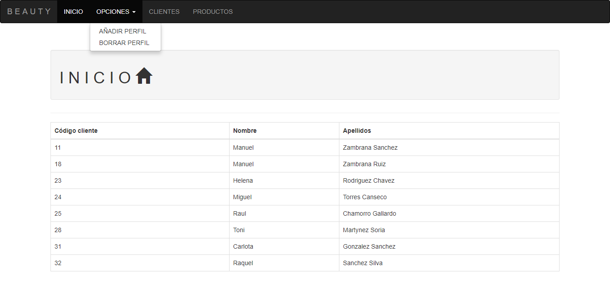
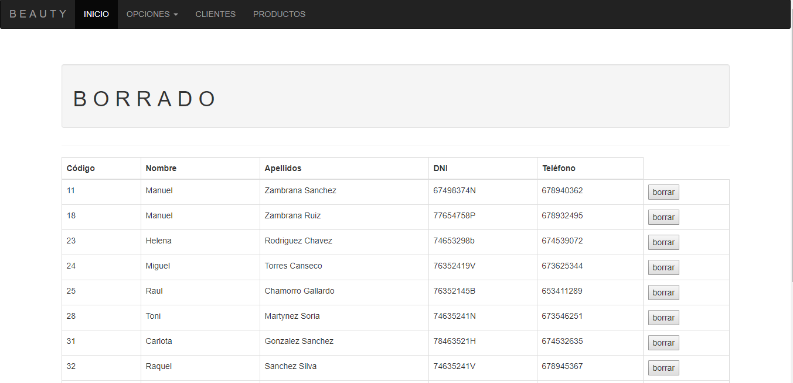
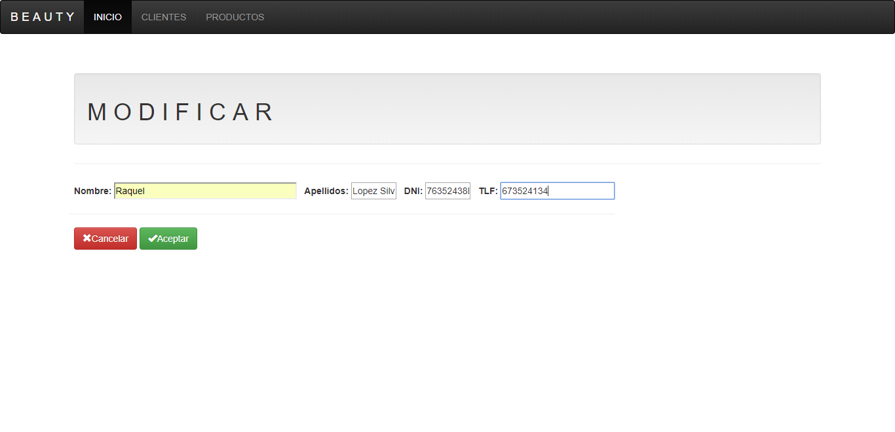

# CRUD_JSP
Esta práctica de CRUD se basará en una base de datos de una tienda de productos de peluquería. 
Dicha base de datos estará compuesta por las tablas producto, cliente y proveedor.

 

# INICIO
 
Nos encontramos con un menú de INICIO, el cual contiene una barra de navegación en la que están presentes una serie de opciones.
En este menú se muestran alguna información de los clientes registrados.
 
 
 

# CLIENTES
 
En clientes se muestra toda la información de éstos, proporcionándonos a su vez la opción de modificar el deseado.
 
 
 

# PRODUCTOS
 
La ventana de productos nos muestra todos los productos regisrados en la tienda,incluyendo su idéntificador, su stock...
 
 
 

# OPCIONES
 
Al hacer click sobre el desplegable "OPCIONES", aparecerán dos nuevos submenús, "AÑADIR PERFIIL" y "BORRAR PERFIL".
 
 
 

# ALTA
 
Al ingresar en la opción "AÑADIR PERFIL" nos encontramos con un formulario, el cual deberemos de completar correctamente, ya que si no, aparecerá un mensaje de advertencia. Una vez completado dicho formulario, aparecerá un mensaje el cual dirá que se ha completado exitosamente el formulario.
 
 
 

# BORRADO
 
Al ingresar en la opción "BORRAR PERFIL", nos encontramos con el listado de clientes, los cuales están acompañados de un botón nombrado "BORRAR". Al hacer click sobre el, se borrará automaticamente el cliente seleccionado.
 
 
 

# MODIFICAR
 
Al hacer click sobre el botón "MODIFICAR" en la ventana "CLIENTES", se nos redirigirá a otro formulario de modificación, el cual deberemos de completar correctamente. 
 
 
 

